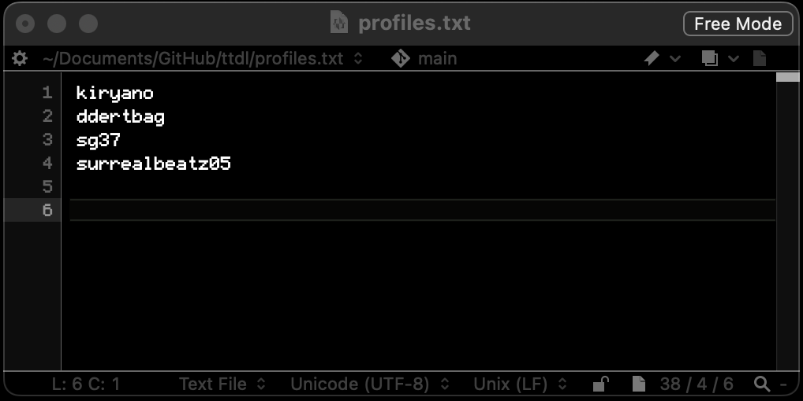

# TTDL
Python3 script for downloading private and public beats from Traktrain using Wayback Machine scrapes


## Install required packages
```
pip install -r requirements.txt
```
## Note
- For downloading multiple profiles at a time, put the username for every profile you want to download into [profiles.txt](https://github.com/claydol/ttdl/blob/main/profiles.txt) line by line



## Check these out :)
https://github.com/ethan-worth/abdl

https://github.com/adithayyil/bsdl

https://github.com/tim-morriss/pyscrapeTrain
